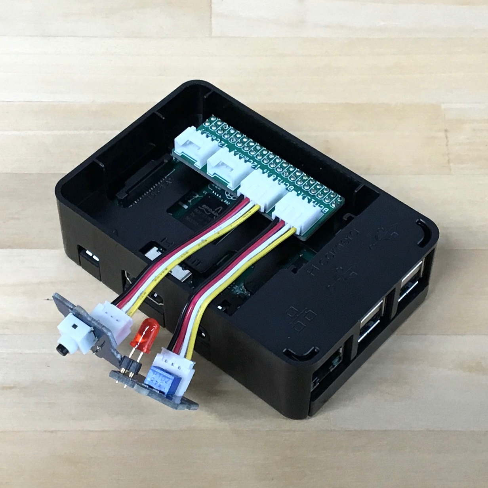

# Grove Base for Raspberry Pi

A bridge between the [**Grove**](http://www.seeedstudio.com/wiki/Category:Grove) family by the Seeed Studio and [Raspberry Pi](https://www.raspberrypi.org/) by the Raspberry Pi Foundation.

## Bill of Materials

|Part/Designator|Manufacture Part Number/Seeed SKU|Quantity|
|---------------|---------------------------------|--------|
|PCB||1|
|J1,J2,J3,J4|Seeed SKU: [320110034](http://www.seeedstudio.com/depot/index.php?main_page=opl_info&opl_id=24)|4|
|JP1|Digi-Key: [S9200-ND](http://www.digikey.com/product-search/en?keywords=S9200-ND)|1|

## How to 'compile'?

Place an order at the [Fusion PCBA prototype](http://www.seeedstudio.com/service/index.php?r=pcb) service.

## Compatible Modules

* Sensors
  * [Grove - Button](http://www.seeedstudio.com/wiki/Grove_-_Button) (as a digital input device, can be used as an analog input device)
  * [Grove - Switch(P)](http://www.seeedstudio.com/wiki/Grove_-_Switch(P))
  * [Grove - Touch Sensor](http://www.seeedstudio.com/wiki/Grove_-_Touch_Sensor)
* Actuators
  * [Grove - LED Socket Kit](http://www.seeedstudio.com/wiki/Grove_-_LED)
  * [Grove - Buzzer](http://www.seeedstudio.com/wiki/Grove_-_Buzzer)

# License Information

This design document is licensed by Shigeru Kobayashi under the terms of the [Creative Commons Attribution-ShareAlike 4.0 International Public License](http://creativecommons.org/licenses/by-sa/4.0/).